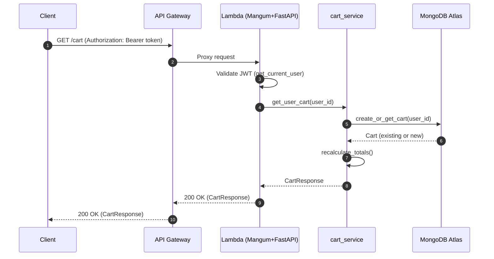
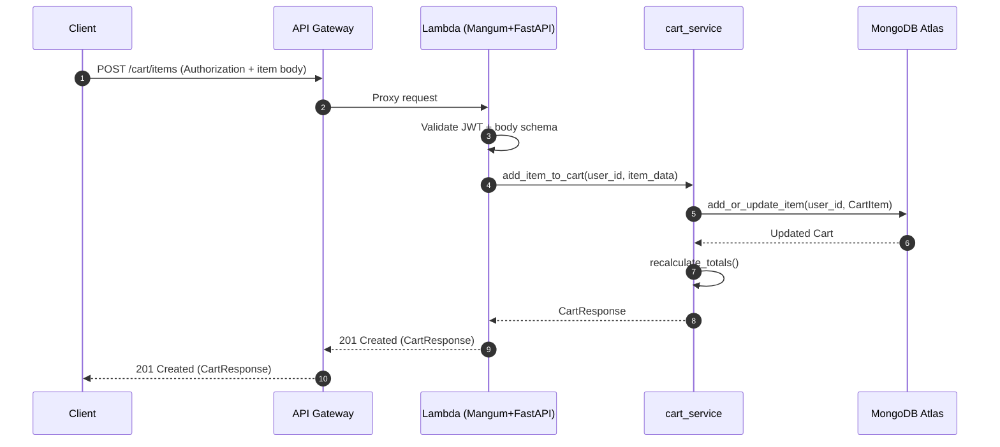
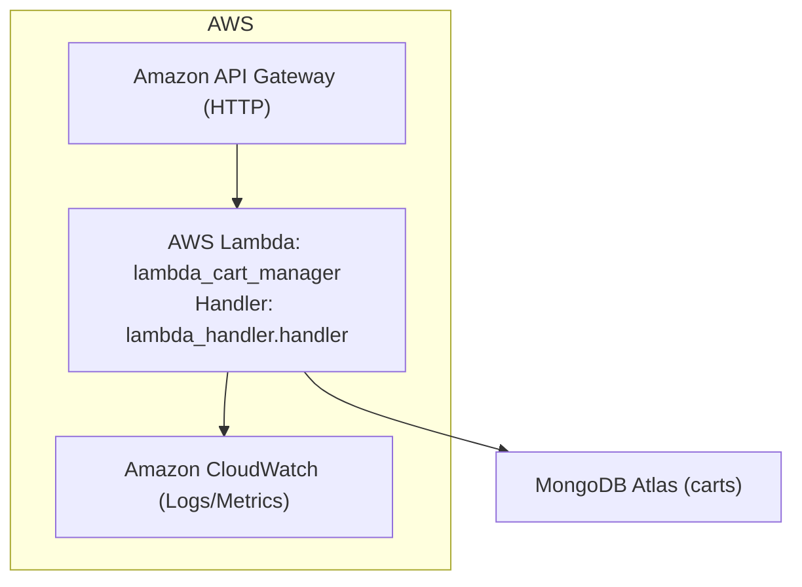

# Lambda Cart Manager — PRD and Architecture

## Executive Summary
The lambda_cart_manager is a FastAPI-based AWS Lambda service that provides real-time shopping cart operations for authenticated users. It integrates with MongoDB Atlas for persistence and uses JWT Bearer tokens for authentication. The service exposes a small set of REST endpoints through API Gateway to get the current cart, add items, update quantities, remove items, and clear the cart. Configuration and secrets are provided exclusively via environment variables; no secrets are hardcoded. This document captures the product context, functional and non-functional requirements, API design, data model, security posture, deployment model, and operational considerations, strictly aligned with the current codebase.

## Goals and Non-Goals
### Goals
- Provide authenticated users with reliable, low-latency cart operations via a serverless API.
- Enforce input validation and robust error handling to maintain data integrity.
- Persist carts in MongoDB Atlas with indexes for performance and data consistency.
- Run in AWS Lambda behind API Gateway, supporting cold start reuse and CloudWatch observability.
- Document OpenAPI, sequences, and operational configuration clearly for easy adoption.

### Non-Goals
- Payments, checkout, pricing rules, inventory management, or product catalog services.
- User authentication provider or token issuance (tokens are validated; not created for end users here).
- Multi-currency/complex promotions logic beyond item totals and quantities.
- Real-time websockets or streaming updates (HTTP-only via API Gateway).

## Personas & User Stories
### Personas
- Shopper: An authenticated end-user maintaining a shopping cart during browsing.
- Web/Mobile Client Developer: Integrates the UI with cart APIs.
- Platform Engineer: Deploys and operates the Lambda service and related infrastructure.

### User Stories
- As a Shopper, I want to retrieve my current cart so I can see items and totals.
- As a Shopper, I want to add a product to my cart so I can purchase it later.
- As a Shopper, I want to update the quantity of a product so totals reflect my intent.
- As a Shopper, I want to remove a product I no longer want.
- As a Shopper, I want to clear my cart quickly.
- As a Developer, I want consistent API responses and errors to simplify integration.
- As a Platform Engineer, I want environment-based configuration and structured logs.

## Functional Requirements
- JWT-authenticated endpoints for:
  - Get cart for current user (auto-create if missing)
  - Add or update item in the cart
  - Update quantity of a specific item
  - Remove an item
  - Clear the cart
- Server-side validation:
  - product_id and name are non-empty strings
  - price is non-negative (rounded to two decimals)
  - quantity is integer in [1, 10000]
  - cart cannot have duplicates (enforced by merging quantities) and <= 1000 unique items
- Automatic totals and item counts computed on each write.
- Health endpoints:
  - GET / returns service health
  - GET /auth-test validates auth path

## API Endpoints
All protected endpoints require JWT Bearer token with a user_id claim.

- GET /cart
  - Auth: Required
  - Response: CartResponse with items, totals, item_count, timestamps
  - Behavior: Creates empty cart if not present
- POST /cart/items
  - Auth: Required
  - Body: CartItemRequest { product_id, name, price, quantity }
  - Response: Updated CartResponse
- PUT /cart/items/{product_id}
  - Auth: Required
  - Body: UpdateQuantityRequest { quantity }
  - Response: Updated CartResponse
- DELETE /cart/items/{product_id}
  - Auth: Required
  - Response: Updated CartResponse
- DELETE /cart
  - Auth: Required
  - Response: Emptied CartResponse
- GET /
  - Health check (no auth)
- GET /auth-test
  - Auth: Required
  - Response: { message, user_id } for verification

Status codes used include 200/201 success paths, 400 validation/business rule errors, 401 unauthorized, and 500 internal errors with safe messages.

## Authentication & Authorization (JWT)
- Bearer JWT in Authorization header (Authorization: Bearer <token>)
- Token must contain user_id claim
- Validated via src/auth/dependencies.get_current_user and jwt_handler
  - Signature and expiration validated using Settings.jwt_secret_key and Settings.jwt_algorithm
  - Token errors mapped to HTTP 401 with standard WWW-Authenticate header
- No token issuance performed here; for local dev, create_access_token exists only as a utility

## Data Model (MongoDB Atlas collections & indexes)
### Collections
- carts
  - One document per user_id
  - Fields:
    - user_id: string (unique)
    - items: array of item documents
      - product_id: string
      - name: string
      - price: number (>= 0.0, rounded to 2 decimals)
      - quantity: integer (1–10000)
      - added_at: ISODate
    - created_at: ISODate
    - updated_at: ISODate

### Indexes
- Unique index: { user_id: 1 } named user_id_unique_idx
- Secondary index: { updated_at: 1 } named updated_at_idx

These indexes are created at startup by src/database/mongodb._create_indexes().

## System Architecture
The service follows a layered structure:
- API Layer (FastAPI)
  - Routes: src/api/routes/cart_routes.py
  - App config and CORS: src/api/main.py
- Auth Layer
  - JWT utilities and FastAPI dependencies: src/auth/
- Service Layer
  - Business logic and validations: src/services/cart_service.py
- Data Access Layer
  - Async Motor client, CRUD helpers, connection lifecycle, indexes: src/database/mongodb.py
- AWS Integration
  - Lambda handler (Mangum wrapper) and lifecycle hooks: lambda_handler.py
  - API Gateway proxies requests to Lambda

High-level path:
API Gateway -> AWS Lambda (Mangum -> FastAPI) -> MongoDB Atlas

### Mermaid: Component Diagram
```mermaid
flowchart LR
  A["Client (Web/Mobile)"] -->|HTTPS (JWT)| B["API Gateway"]
  B -->|Lambda Proxy| C["AWS Lambda (Mangum + FastAPI)"]
  C --> D["Auth Layer (JWT validation)"]
  C --> E["Service Layer (cart_service)"]
  E --> F["Data Layer (mongodb.py Motor client)"]
  F --> G["MongoDB Atlas (carts collection)"]
```

## Sequence Diagrams for Key Flows
### Get Cart


### Add Item


### Update Quantity / Remove Item / Clear Cart
- Follow a similar sequence: validate auth and request, call a single service function (update_cart_item, remove_cart_item, clear_user_cart), DB updates via mongodb.py, recalculate totals, return CartResponse.

## Non-Functional Requirements
- Performance
  - Target p95 latency: <= 200ms warm, <= 1000ms cold, excluding network to Atlas
  - Automatic totals computation is O(n) by items; typical cart sizes are small (<50 items)
- Availability
  - Leverages AWS Lambda and API Gateway managed availability
  - MongoDB Atlas is multi-AZ (per chosen tier and configuration)
- Scalability
  - Horizontal auto-scale with Lambda concurrency
  - MongoDB Atlas cluster scaling per workload
- Latency
  - Warm Lambda reuse and Motor connection pooling minimize latency
- Observability
  - Logging via Python logging; CloudWatch Logs ingestion by default
  - Enable X-Ray optionally
  - Consider business metrics via Embedded Metric Format for critical counters

## Security & Compliance
- OWASP: Input validation, structured error handling without leaking internals, no secrets in logs, authentication enforced on endpoints.
- NIST SSDF alignment highlights:
  - Secure configuration via environment variables (no hardcoded secrets)
  - Dependency pinning (requirements.txt) and isolation
  - Least privilege: use IAM roles for Lambda; consider VPC if required by Atlas networking
  - Threat considerations: JWT tampering/expiration handled; rate limiting, WAF, and throttling configurable in API Gateway
- Transport: TLS enforced by API Gateway; MongoDB SRV URIs typically TLS-enabled
- Secrets: JWT secret and DB URI injected via environment variables; suggest use of Secrets Manager/Parameter Store

## Configuration & Environment Variables
From src/config/settings.py and lambda_handler.py:
- MONGODB_URI: MongoDB Atlas URI (required; starts with mongodb:// or mongodb+srv://)
- MONGODB_DATABASE: Database name (required)
- JWT_SECRET_KEY: Min 32 chars (required)
- JWT_ALGORITHM: One of [HS256, HS384, HS512, RS256, RS384, RS512] (default HS256)
- JWT_EXPIRATION_MINUTES: Integer > 0 (default 30)
- ENVIRONMENT: development|staging|production (default development)
- ALLOWED_ORIGINS: CORS allowlist, comma-separated (default *)

No secrets are hardcoded; .env is optional for local only.

## Error Handling & Logging
- Errors use typed exceptions in service and database layers (e.g., InvalidCartDataError, CartServiceError, DatabaseError).
- API layer maps to HTTP status codes:
  - 400 for validation/business rule failures
  - 401 for JWT failures
  - 500 for unexpected/server-side errors
- Logging:
  - Context-rich logging (user_id, product_id) avoiding sensitive data
  - Stack traces for server errors (exc_info=True)
  - Warnings for validation issues; info for successful operations

## Testing Strategy
- Unit Tests:
  - Model validations (CartItem, Cart)
  - Service logic (recalculate, add, update, remove, clear)
  - Auth utilities (token decoding, expiration)
- Integration Tests:
  - Route tests via TestClient or HTTPX/anyio
  - Motor against local MongoDB or in-memory/mocked layer
- Performance Tests:
  - k6/Locust for p95 latency and concurrency validation (cart endpoints)
- Security Tests:
  - JWT misuse scenarios, boundary validation, header handling
- Documentation Tests:
  - OpenAPI generator script (src/api/generate_openAPI.py) produces interfaces/openapi.json

## Deployment & Operations
- Packaging and Deploy:
  - Python 3.11 runtime
  - Dependencies pinned in requirements.txt
  - Handler: lambda_handler.handler (Mangum wrapper)
  - API Gateway:
    - ANY /{proxy+} Lambda proxy integration
  - Memory: 512–1024 MB recommended; Timeout: ~30s
- Environment:
  - Set environment variables listed above
  - Consider Secrets Manager and VPC networking for Atlas Private Endpoint
- Monitoring:
  - CloudWatch Logs, Metrics
  - X-Ray optional
  - API Gateway access logs and throttling
- Rollout:
  - Use aliases/versions for Lambda
  - Canary deployments via CodeDeploy (optional)

### Mermaid: Deployment Diagram


## Risks & Mitigations
- Cold starts increase latency
  - Mitigate with provisioned concurrency if needed
- MongoDB connectivity issues
  - Motor retries; monitor with CloudWatch; alerting on error spikes; consider regional proximity and VPC peering/Private Endpoint
- JWT misuse (expired/invalid tokens)
  - Validation with clear 401 responses; minimize information leakage
- Data growth / index performance
  - Proper indexing on user_id; periodic performance reviews for query paths
- Cost unpredictability under bursty load
  - API Gateway and Lambda throttling; WAF/rate-limits; budgets and alarms

## OpenAPI Summary / Outline
- Title: Cart Management API
- Version: 1.0.0
- Tags: health, cart
- SecuritySchemes: HTTP bearer named “Bearer”
- Paths:
  - GET / (health)
  - GET /auth-test (auth-validated echo)
  - GET /cart (CartResponse)
  - POST /cart/items (CartItemRequest -> CartResponse, 201)
  - PUT /cart/items/{product_id} (UpdateQuantityRequest -> CartResponse)
  - DELETE /cart/items/{product_id} (CartResponse)
  - DELETE /cart (CartResponse)
- Schemas:
  - CartItem, CartItemRequest, UpdateQuantityRequest
  - CartResponse
  - ValidationError types

## Appendix: Source Alignment
This documentation is derived from and aligned with:
- API: src/api/main.py, src/api/routes/cart_routes.py
- Auth: src/auth/dependencies.py, src/auth/jwt_handler.py
- Services: src/services/cart_service.py
- Data: src/database/mongodb.py
- Models: src/models/cart.py
- Lambda: lambda_handler.py
- OpenAPI generation: src/api/generate_openapi.py
